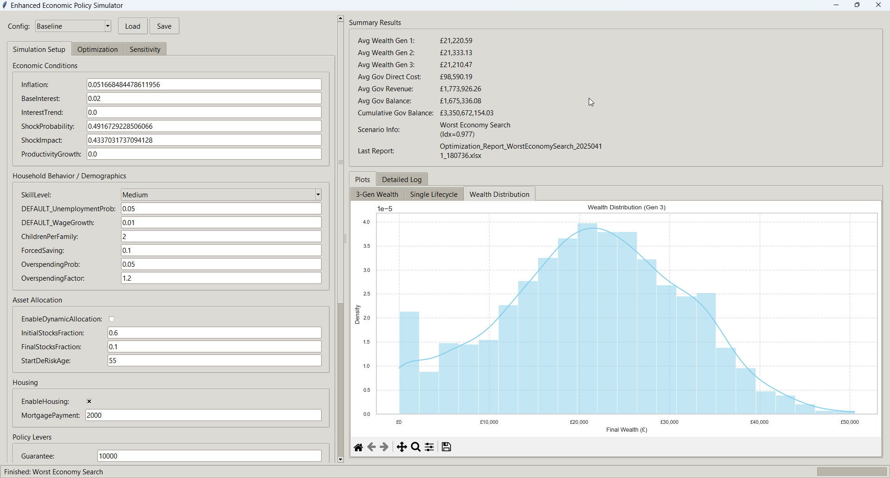

# GenerationalWealthPolicySim

A Python toolkit to simulate **multi‐generation wealth dynamics** under various economic policies.  
It models **income**, **taxation**, **inflation**, **shocks**, **forced saving**, **UBC**, and more.  
Use it to explore how small policy tweaks can **ripple** across generations, or to find **worst‐case** scenarios where the economy is harsh yet families still maintain positive wealth.




---

## Features

1. **Three-Generation Simulation**  
   - Each generation (85 years) passes wealth (minus inheritance tax) to the next.  
   - Tracks real returns (investment minus inflation), forced saving, shock events, etc.

2. **Advanced Parameters**  
   - **Wage growth**, **unemployment risk**, **healthcare/retirement costs**, **overspending** probabilities.  
   - **Tax brackets** for income, **progressive inheritance tax**, **wealth tax** above a threshold.

3. **Tkinter GUI**  
   - User‐friendly interface to set parameters (inflation, shock probability, forced saving, etc.).  
   - Plots both the **multi‐generation** average wealth and a **single‐lifecycle** breakdown (income, consumption, savings, assets).

4. **Selective Optimization**  
   - Toggle which parameters to “optimize” (via a simple random search).  
   - Find best/worst scenarios under user‐defined objective (e.g., highest final wealth, or “worst economy” that remains above zero wealth).

5. **Harsh Scenario Exploration**  
   - Search for inflation + shock settings that maximize “bad economy index” but still keep all generations’ wealth positive, with minimal government cost.

---
Use these files:
** Open_Society_Simulator_V002.py
** FOC_GA_V08.py
## Quick Start

1. **Install dependencies**  
   ```bash
   pip install numpy pandas matplotlib
